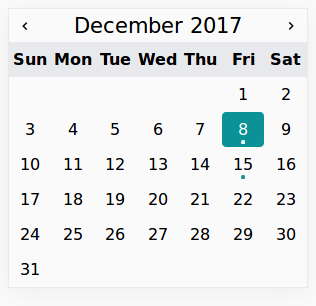
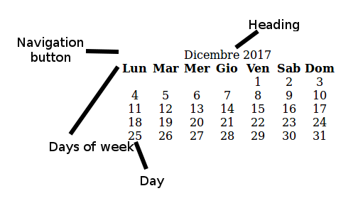

# JSCal
_JSCal_ is a simple, light and highly customiziable calendar written in Vanilla JS. Its main purpose is to display wether or not a resource is available in a certain date (e.g. a hotel room).

If you want to try it, go [here](https:/eutampieri.github.io/JSCal)


## Features
* **Themeable**: _JSCal_ comes with a basic stylesheet and you can customize the appearance.
* **Localizable**: you can add localizations for your language
* **Lightweight**: 4.1 kB minified
* **Responsive**
## Requirements
* [CSS `display: flex`](https://caniuse.com/#feat=flexbox)
* [JS `Array.prototype.indexOf()`](https://caniuse.com/#feat=es5)
## Usage
To display a basic calendar, just
```html
<script src="calendar.js"></script>
<link rel="stylesheet" href="calendar.css">
<div id="your-calendar-div"></div>
<script>
    Calendar.load(document.getElementById("your-calendar-div"));
</script>
```
To display a basic calendar with full length month names, you have to add a single line:
```html
<script src="calendar.js"></script>
<link rel="stylesheet" href="calendar.css">
<div id="your-calendar-div"></div>
<script>
    Calendar.fullSizeText=true;
    Calendar.load(document.getElementById("your-calendar-div"));
</script>
```
To display the calendar with dates marked, you have to populate the `Calendar.markedDates` array with Unix timestamps **in seconds**, not milliseconds:
```html
<script src="calendar.js"></script>
<link rel="stylesheet" href="calendar.css">
<div id="your-calendar-div"></div>
<script>
    var d=new Date();
    Calendar.markedDates=[parseInt(new Date(d.getFullYear(), d.getMonth(), d.getDate()+7).getTime()/1000)];
    Calendar.markedDates=[true];
    Calendar.load(document.getElementById("your-calendar-div"));
</script>
```
## Add a localization
In order to add a localization you have to put in the `lang` directory two files: `<ISO 639-1>.lang` (e.g. `en.lang`) and `full-<ISO 639-1>.lang`. The first file is to provide the localization for the compact version, the second is to provide localized strings for the full length version. Both files have the same structure.

Here's an example for English:
`en.lang`
```json
{
    "MondayFirst":false,
    "days":["S","M","T","W","T","F","S"],
    "months":["Jan", "Feb", "Mar", "Apr", "May", "Jun","Jul", "Aug","Sep","Oct","Nov","Dec"]
}
```
`full-en.lang`
```json
{
    "MondayFirst":false,
    "days":["Sun","Mon","Tue","Wed","Thu","Fri","Sat"],
    "months":["January", "February", "March", "April", "May", "June","July", "August","September","October","November","December"]
}
```
- `MondayFirst` is a boolean variable that specifies wether or not the first day of week is Monday
- `days` is an array of strings for days description
- `months` is an array of strings for months description

If you make a localization file, you would be very kind if you open a pull request or send patch, so your work could help others.
## Theming
To theme the calendar you first have to understand its structure.


* Heading bar (CSS class `cal-head`)
  - Navigation buttons (CSS classes `cal-button`, for both, `cal-button-l`, for the left navigation button and `cal-button-r` for the right one)
  - Month and year, used also as a button to go back to the current month (CSS class `cal-month`)
* Calendar wrapper
  - Days of week (CSS class `.cal-h-day`)
  - Days (CSS class `.cal-day`)
  - Today (CSS class `.cal-today`)
  - Marked days (CSS class `.cal-marked`)

It's worth noting that the minimal _JSCal_ **doesn't** have navigation buttons so you can choose to use an image or a character. If you want to use a character, then
```css
.cal-button-l::after{
    content: "<";
}
.cal-button-r::after{
    content: ">";
}
```
Otherwise, look at the theme used in the demo:
```css
#calendario{
    max-width:500px;
    margin:auto;
    font-family: sans-serif;
    box-shadow: 0 4px 22px 0 rgba(0, 0, 0, 0.05);
    border: solid 1px #e7e9ed;
}
.cal-button{
    height:1em;
    background-repeat: no-repeat;
    background-size: contain;
    background-position: center;
    background-image: url(https://storage.googleapis.com/material-icons/external-assets/v4/icons/svg/ic_keyboard_arrow_right_black_24px.svg);
    margin: auto;
}
.cal-button-l {
    transform: rotate(180deg);
}
.cal-day, .cal-h-day{
    padding:0.5em 0;
}
.cal-day{
    border-radius: 0.25em;
}
.cal-h-day{
    background-color:#E7E9ED;
}
.cal-today{
    background-color: #0A9297;
    color:#fff;
}
.cal-marked{
    padding-bottom: 0.3em;
    background-image: url(dot.svg);
    background-size: 0.3em;
    background-repeat: no-repeat;
    background-position: center 1.7em;
}
.cal-marked.cal-today{
    background-image: url(wdot.svg)!important;
}
.cal-month{
    font-size:1.3em;
    margin:0.2em 0;
}
```
If you write a theme and you think others could appreciate it, open a pull request or send a patch
